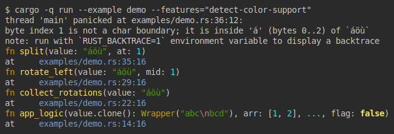

# unwind-context

[](https://github.com/zheland/unwind-context/actions)
[](https://crates.io/crates/unwind-context)
[](https://docs.rs/unwind-context)
[](https://codecov.io/gh/zheland/unwind-context)
[](https://deps.rs/repo/github/zheland/unwind-context)
[](https://crates.io/crates/unwind-context)
[](https://github.com/zheland/unwind-context/#license)
[](https://blog.rust-lang.org/2023/06/01/Rust-1.70.0.html)

The `unwind-context` crate makes debugging panics easier
by adding a colored panic context with a simple macro.

[](examples/demo.rs)

## Introduction

In Rust, panics are typically used when an
[unrecoverable](https://doc.rust-lang.org/book/ch09-01-unrecoverable-errors-with-panic.html)
error occurs or when writing examples, prototype code, or tests.

However, it can be difficult to pinpoint the exact cause of a panic,
especially if it happens deep in the code or within a loop. While adding
logs can help, this may lead to a large number of log entries, making it
challenging to identify which ones are related to the panic.

## About

The goal of this crate is to make the panic context addition simple, and the
context itself detailed enough, and easy to read. Accordingly, it also makes
it easier to add context to assertions in your tests. This crate provides
[`unwind_context`] and [`debug_unwind_context`] macros and some other
auxiliary types, traits, functions, and macros that help you define function
or scope context and write it to [`std::io::stderr`] or another
writeable target if panic occurs. If panic occurs, the context will be
written in "reverse" chronological order during the unwinding process.

This library adds very little overhead to compiled functions unless they are
panicked:
- First, it constructs a structure containing the context data, code
  location, writer, and color scheme on the stack. It also stores a
  reference to the custom panic detector, if specified.
- Finally, it adds a check for [`std::thread::panicking`] and calls the cold
  print function if panic has been detected.

This crate is intended for diagnostic use. The exact contents and format of
the messages printed on panic are not specified, other than being a clear
and compact description.

Note that the context will only be printed if the
[`panic`](https://doc.rust-lang.org/cargo/reference/profiles.html#panic)
setting is set to `unwind`, which is the default for both
[`dev`](https://doc.rust-lang.org/cargo/reference/profiles.html#dev)
and
[`release`](https://doc.rust-lang.org/cargo/reference/profiles.html#release)
profiles.

## Usage

First, add the following to your `Cargo.toml`:
```toml
[dependencies]
unwind-context = "0.2.1"
```

Then, add the macro call with the given function arguments or scope
arguments to the beginning of the functions to be tracked and bind the
result to some scope variable (otherwise the unwind context scope guard will
be immediately dropped):
```rust
use unwind_context::unwind_context;

fn func1(a: u32, b: &str, c: bool) {
    let _ctx = unwind_context!(fn(a, b, c));
    // ...
    for i in 0..10 {
        let _ctx = unwind_context!(i);
        // ...
    }
    // ...
}
```

With `unwind_context!(a, b, c)` syntax, it will print code location,
given argument names (stringified expressions), and values on unwind,
whereas with `unwind_context!(fn(a, b, c))` it will also print function
names as well. Note that it uses the [`core::fmt::Debug`] representation. If
you want to use the [`core::fmt::Display`] representation, you can use the
[`WithDisplay`] wrapper.

You can use the [`set_colors_enabled`] function to unconditionally enable
the 16-ANSI-color colorization. If you want to enable colorization only if
supported by the terminal, you can use the [`enable_colors_if_supported`]
function, which will require enabling the
[`detect-color-support`](#feature-flags) feature flag:
```toml
[dependencies.unwind-context]
version = "0.2.1"
features = [ "detect-color-support" ]
```
```rust
fn main() {
    unwind_context::enable_colors_if_supported();
    // ...
}

#[test]
fn test() {
    unwind_context::enable_colors_if_supported()
    // ...
}
```

If you want to specify a custom color scheme, you can use the
[`set_default_color_scheme`] function.
Also, colorization can be customized separately for each context scope guard
with the [`unwind_context_with_io`] and [`unwind_context_with_fmt`] macros.

This crate depends on the standard library by default that is needed to
write to [`std::io::stderr`] and to detect panicking using
[`std::thread::panicking`]. To use this crate in a `#![no_std]` context with
your custom [`core::fmt::Write`] writer and custom [`PanicDetector`], use
`default-features = false` in your `Cargo.toml` as shown below:
```toml
[dependencies.unwind-context]
version = "0.2.1"
default-features = false
```

## Examples

The following crate example:
```rust
#![allow(missing_docs, unused_crate_dependencies)]

use unwind_context::unwind_context;

#[derive(Clone, Debug)]
struct Wrapper<T>(T);

fn main() {
    unwind_context::enable_colors_if_supported();
    app_logic(Wrapper("abc\nbcd".to_owned()), &[1, 2], "secret", false);
}

fn app_logic(value: Wrapper<String>, arr: &[u8], secret: &str, flag: bool) {
    let _ctx = unwind_context!(fn(value.clone(), arr, ..., flag));
    // ...
    let _ = collect_rotations("áöù");
    // ...
    let _ = (value, arr, secret, flag);
}

fn collect_rotations(value: &str) -> Vec<String> {
    let _ctx = unwind_context!(fn(value));
    (0..value.len())
        .map(|mid| rotate_left(value, mid))
        .collect()
}

fn rotate_left(value: &str, mid: usize) -> String {
    let _ctx = unwind_context!(fn(value, mid));
    let (left, right) = split(value, mid);
    format!("{right}{left}")
}

fn split(value: &str, at: usize) -> (&str, &str) {
    let _ctx = unwind_context!(fn(value, at));
    (&value[0..at], &value[at..])
}
```
will output:


## Macro expansion

The following function:
```rust
use unwind_context::unwind_context;

fn foo(a: &str, b: Vec<u8>, c: bool, d: String) {
    let _ctx = unwind_context!(fn(a, &b, ..., d.clone()));
    // ...
    for i in 0..10 {
        let _ctx = unwind_context!(i);
        // ...
    }
}
```
will partially expand into:
```rust
fn foo(a: u32, b: Vec<u8>, c: bool, d: String) {
    let _ctx = unwind_context::UnwindContextWithIo::new(
        unwind_context::UnwindContextFunc::new(
            {
                struct Item;
                let module_path = ::core::module_path!();
                let item_type_name = ::core::any::type_name::<Item>();
                unwind_context::func_name_from_item_type_name(
                    module_path, item_type_name
                )
            },
            (
                unwind_context::UnwindContextArg::new(Some("a"), a),
                (
                    unwind_context::UnwindContextArg::new(Some("&b"), &b),
                    (
                        unwind_context::UnwindContextArg::new(
                            None,
                            unwind_context::NonExhaustiveMarker,
                        ),
                        (
                            unwind_context::UnwindContextArg::new(
                                Some("d.clone()"), d.clone()
                               ),
                            (),
                        ),
                    ),
                ),
            ),
        ),
        ::std::io::stderr(),
        unwind_context::StdPanicDetector,
        unwind_context::get_default_color_scheme_if_enabled(),
    );
    // ...
    for i in 0..10 {
        let _ctx = unwind_context::UnwindContextWithIo::new(
            unwind_context::UnwindContextArgs::new((
                unwind_context::UnwindContextArg::new(Some("i"), i),
                (),
            )),
            ::std::io::stderr(),
            unwind_context::StdPanicDetector,
            unwind_context::get_default_color_scheme_if_enabled(),
        );
        // ...
    }
}
```

## Documentation

[API Documentation]

## Feature Flags

- `std` (enabled by default): Enables [`UnwindContextWithIo`] structure,
  [`unwind_context`], [`debug_unwind_context`], [`unwind_context_with_io`],
  and [`debug_unwind_context_with_io`] macros.
- `detect-color-support`: Enables [`enable_colors_if_supported`] function
  and [`supports-color`] optional dependency.
- `custom-default-colors`: Enables [`set_default_color_scheme`] function and
  [`atomic_ref`] optional dependency.

## Similar crates

- [`scopeguard`] allows you to run any code at the end of a scope. It has
  both success and unwind guard variants.
- [`panic-context`] allows you to specify and modify panic context using a
  custom panic hook. It provides more fine-grained control over the output
  but doesn’t add any automatic context or colorization.

## License

Licensed under either of

- Apache License, Version 2.0 ([LICENSE-APACHE](LICENSE-APACHE) or <https://www.apache.org/licenses/LICENSE-2.0>)
- MIT license ([LICENSE-MIT](LICENSE-MIT) or <https://opensource.org/licenses/MIT>)

at your option.

## Contribution

Unless you explicitly state otherwise, any contribution intentionally
submitted for inclusion in the work by you, as defined in the Apache-2.0
license, shall be dual licensed as above, without any
additional terms or conditions.

[API Documentation]: https://docs.rs/unwind-context
[`std::io::stderr`]: https://doc.rust-lang.org/nightly/std/io/stdio/fn.stderr.html
[`core::fmt::Write`]: https://doc.rust-lang.org/nightly/core/fmt/trait.Write.html
[`core::fmt::Debug`]: https://doc.rust-lang.org/nightly/core/fmt/trait.Debug.html
[`core::fmt::Display`]: https://doc.rust-lang.org/nightly/core/fmt/trait.Display.html
[`std::thread::panicking`]: https://doc.rust-lang.org/std/thread/fn.panicking.html
[`unwind_context`]: https://docs.rs/unwind-context/*/unwind_context/macro.unwind_context.html
[`debug_unwind_context`]: https://docs.rs/unwind-context/*/unwind_context/macro.debug_unwind_context.html
[`unwind_context_with_io`]: https://docs.rs/unwind-context/*/unwind_context/macro.unwind_context_with_io.html
[`debug_unwind_context_with_io`]: https://docs.rs/unwind-context/*/unwind_context/macro.debug_unwind_context_with_io.html
[`unwind_context_with_fmt`]: https://docs.rs/unwind-context/*/unwind_context/macro.unwind_context_with_fmt.html
[`set_colors_enabled`]: https://docs.rs/unwind-context/*/unwind_context/fn.set_colors_enabled.html
[`enable_colors_if_supported`]: https://docs.rs/unwind-context/*/unwind_context/fn.enable_colors_if_supported.html
[`set_default_color_scheme`]: https://docs.rs/unwind-context/*/unwind_context/fn.set_default_color_scheme.html
[`WithDisplay`]: https://docs.rs/unwind-context/*/unwind_context/struct.WithDisplay.html
[`UnwindContextWithIo`]: https://docs.rs/unwind-context/*/unwind_context/struct.UnwindContextWithIo.html
[`PanicDetector`]: https://docs.rs/unwind-context/*/unwind_context/trait.PanicDetector.html
[`supports-color`]: https://crates.io/crates/supports-color
[`atomic_ref`]: https://crates.io/crates/atomic_ref
[`scopeguard`]: https://crates.io/crates/scopeguard
[`panic-context`]: https://crates.io/crates/panic-context
